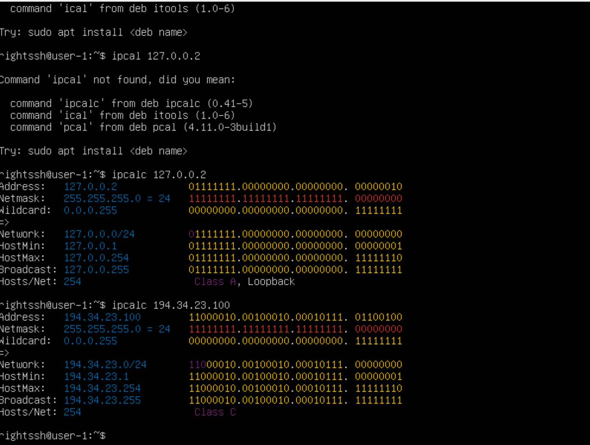
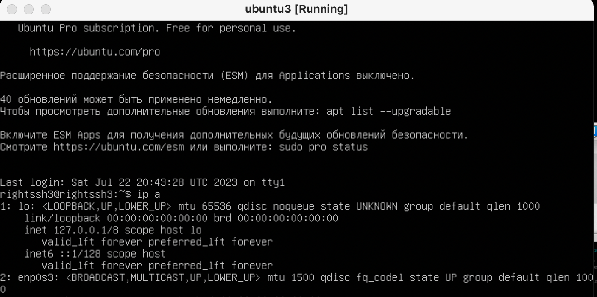
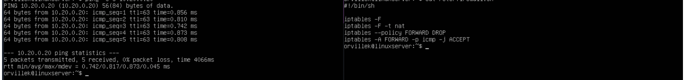

## Часть 1. Инструмент ipcalc.

- `` для начала работы нужно установить ipcal c помощью команды``  

``$ sudo apt install ipcal``

## Сети и маски

``1`` 

- ``Адрес сети 192.167.38.54/13``  

``$ ipcalc 192.167.38.54/13``

 

``2`` 

- ``Перевод маски 255.255.255.0 в префиксную и двоичную запись``  

``$ ipcalc 255.255.255.0``
  
 

- ``/15 в обычную и двоичную`` 
   
`` $ ipcalc 0.0.0.0/15``

 

- ``11111111.11111111.11111111.11110000 в обычную и префиксную`` 

`` $ ipcalac 0.0.0.0/28``

 

``3``  

- ``Минимальный и максимальный хост в сети 12.167.38.4 при маске /8``  

`` $ ipcalc 12.167.38.4/8``

  

- ``Минимальный и максимальный хост в сети 12.167.38.4 при маске 11111111.11111111.00000000.00000000`` 

`` $ ipcalc 12.167.38.4/16 ``

  

- ``Минимальный и максимальный хост в сети 12.167.38.4 при маске 255.255.254.0`` 

`` $ ipcalc 12.167.38.4/23 ``

  

- ``Минимальный и максимальный хост в сети 12.167.38.4 при маске /4`` 

`` $ ipcalc 12.167.38.4/4 ``

  

# 1.2 Localhost

- ``можно получить доступ с``  

``с помощью команы ipcalc + номер ip я проверил адрес и пршел к следующему выводу`` 

``127.0.0.2``

``127.1.0.1``

``не могу с``

``194.34.23.100``

``128.0.0.1``

  

- ``Четкая Loopback классификация (и ее отсутствие) доказывает это:``

## 1.3. Диапазоны и сегменты сети

``1 Эти перечисленные IP-адреса можно использовать как общедоступные:``  

``134.43.0.2,``
``172.0.2.1,``
``192.172.0.1,``
``172.68.0.2,``
``192.169.168.1``

``2 Эти перечисленные IP-адреса могут использоваться как частные:``  

``10.0.0.45,``

``192.168.4.2,``

``172.20.250.4,``

``172.16.255.255,``

``10.10.10.10``

  

``Четкая Private Internetклассификация (и ее отсутствие) доказывает наличие в списке:``

``3. 10.10.0.0/18 Для сети возможны следующие IP-адреса шлюза :``

``10.10.0.2,``
``10.10.10.10,``
``10.10.1.255``

---

## Часть 2. Статическая маршрутизация между двумя машинами
- ``Запускаю две виртуальные машины``  

  

- `` Спомощью команды $ ip a просматриваю существующие сетевые интерфейсы`` 

  

``Добавляю в отчет скриншоты измененного файла ``

``$sudo vim /etc/netplan/00-installer-config.yaml``

  

``$sudo netplan apply``

  

``после применения сети``

  

## 2.1. Добавление статического маршрута вручную

``Добавляю статический маршрут от одной машины к другой и обратно с помощью команды`` 

`` $ ip r add``

  

``Пропинговал соединение между машинами.`` 

  

## 2.2. Добавление статического маршрута с сохранением

``Перезагрузите машины``

  

``Добавил статический маршрут с одной машины на другую``

``etc/netplan/00-installer-config.yaml.``

  

``Пропинговал соединение между машинами``

  

---

## Часть 3. Утилита iperf3

- ``Перевести и записать в отчёт: 8 Mbps в MB/s, 100 MB/s в Kbps, 1 Gbps в Mbps``  

``8Mbps == 1MB/s;``

``100MB/s == 819200 Kbps;``

``1Gbps == 1024 Mbps.``

``Измерить скорость соединения между машинами Ubuntu и Ubuntu2``

- ``Измерить скорость соединений между ubuntu и ubuntu2`` 

``Для начало нужно установить iperf3``

``$ sudo apt install iperf3``

  

``Чтобы использовать утилиту и скорость, необходимо сначала одну из машин настроить сервером ubuntu по загрузке. iperf3`` 
 
``-s -f K (-s - запуск сервера, -f - вывод в формат Кбайт)``

``На ubuntu2 запускаем iperf3 как машину-клиента`` 

``iperf3 -c 192.168.100.10 -f K (используем адрес хоста - 1й машины)``

  

---
## Часть 4. Сетевой брандмауэр

## 4.1. iptables полезность

``Утилита iptables служит для проверки сетевых пакетов. В фильтре iptables все пакеты делятся на три основные цепочки:``

``input - обрабатывает входящие пакеты и подключения``
``forward - применяется для проходящих соединений``
``output - используется для исходящих пакетов и соединений`` 
``а также существуют две вспомогательные:``
``prerouting - в эту цепочку пакет попадает перед обработкой iptables, система еще не знает куда он будет отправлен, в input, output или forward;``
``postrouting - сюда попадают все проходящие пакеты, которые уже прошли цепочку forward``

``Для каждого типа пакетов можно установить набор правил, которые по очереди будут проверяться на соответствие с пакетом и если пакет соответствует, то применять к нему указанное в правиле действие. Правила образуют цепочку, поэтому input, output и forward называют цепочками, цепочками правил. Действий может быть несколько:``

``ACCEPT - разрешить прохождение пакета дальше по цепочке правил;``
``DROP - удалить пакет;``
``REJECT - отклонить пакет, отправителю будет отправлено сообщение, что пакет был отклонен;``
``LOG - сделать запись о пакете в лог файл;``
``QUEUE - отправить пакет пользовательскому приложению.``

  

``2. Запуская на обеих машинах команды``

``$ chmod +x /etc/firewall.sh``

``$ /etc/firewall.sh``

  

`` После введения команд мы снова пингуем обе машины и видим,Так как утилита iptabels выполняет первое прочитанное правило, разница между стратегиями заключается в порядке команд. Для машины ubuntu первой стоит команда REJECT - отклонить пакет. Будет выполнятся этот запрет и пинг не пройдет. Для машины ubuntu2 напротив, первым стоит ACCEPT - разрешить прохождение пакета. Пинг проходит.``

## 4.2. Утилита nmap
 
 ``nmap — это аббревиатура от «Network Mapper» это инструмент командной строки Linux для исследования сети и аудита безопасности``

 ``Для работы с утилиотй для начала устанавливаем ее командой``

 ``$ sudo apt install nmap``

`` Далее с помощью команы``

`` $ ping 192.168.100.10``

`` Видим что машина не пингуется, вводим команду $ nmap 192.168.100.10 и получаем отчет``

  

---

## Part 5. Статическая маршрутизация сети

``Настроить конфигурации машин в etc/netplan/00-installer-config.yaml согласно сети на рисунке.``

  

## 5.1. Настройка адресов машин

## Настройка адресов машин
``Настроить конфигурации машин в etc/netplan/00-installer-config.yaml согласно сети на рисунке.``

``ubuntu``

  

``ubuntu2``

  

``ubuntu3``

  

``ubuntu4``

  

``ubuntu5``

  

- ``Перезапустить сервис сети. Если ошибок нет, то командой ip -4 a проверить, что адрес машины задан верно.``

  

- ``Также пропинговать ubutu5 с ubuntu4. Аналогично пропинговать ubuntu с ubuntu3``

  

  

## Включение переадресации IP-адресов.

``Для включения переадресации IP, выполните команду на роутерах``

``sysctl -w net.ipv4.ip_forward=1``

  

``Открываю файл /etc/sysctl.conf и добавляю в него следующую строку``

``net.ipv4.ip_forward = 1``

  

## Установка маршрута по-умолчанию

``Настроить маршрут по-умолчанию (шлюз) для рабочих станций. Для этого добавить gateway4 [ip роутера] в файле конфигураций Вызвать ip r и показать, что добавился маршрут в таблицу маршрутизации``

  

``пинг ubuntu3 на ubuntu2``

  

## 5.4. Добавление статических маршрутов

``Добавил в роутеры ubuntu и ubuntu2 статические маршруты в файле конфигураций``

  

``Вызвать ip r и показать таблицы с маршрутами на обоих роутерах``

``ip r``

  

``Запустить команды на ws11:``

``ip r list 10.10.0.0/18``

``ip r list 0.0.0.0/0``

  

``Для адреса 10.10.0.0/18 был выбран маршрут, отличный от 0.0.0.0/0, поскольку он является адресом сети и доступен без шлюза.``

## 5.5. Построение списка маршрутизаторов

``Запустить на ubuntu команду`` 

``tcpdump -tnv -i eth0``

  

``При помощи утилиты traceroute построить список маршрутизаторов на пути от ubuntu3 до ubuntu4``

  

``Для определения промежуточных маршрутизаторов traceroute отправляет целевому узлу серию ICMP-пакетов (по умолчанию 3 пакета), с каждым шагом увеличивая значение поля TTL («время жизни») на 1. Это поле обычно указывает максимальное количество маршрутизаторов, которое может быть пройдено пакетом. Первая серия пакетов отправляется с TTL, равным 1, и поэтому первый же маршрутизатор возвращает обратно ICMP-сообщение «time exceeded in transit», указывающее на невозможность доставки данных. Traceroute фиксирует адрес маршрутизатора, а также время между отправкой пакета и получением ответа (эти сведения выводятся на монитор компьютера). Затем traceroute повторяет отправку серии пакетов, но уже с TTL, равным 2, что заставляет первый маршрутизатор уменьшить TTL пакетов на единицу и направить их ко второму маршрутизатору. Второй маршрутизатор, получив пакеты с TTL=1, так же возвращает «time exceeded in transit».``

## Использование протокола ICMP при маршрутизации

``Запустить на ubuntu перехват сетевого трафика, проходящего через eth0 с помощью команды``

``tcpdump -n -i snp0s8 icmp``

``Пропинговать с ubuntu3 несуществующий IP (например, 10.30.0.111) с помощью команды:``

``ping -c 1 10.30.0.111``

  

---

## №6. Динамическая настройка IP с помощью DHCP

``Для ubuntu2 настроить в файле /etc/dhcp/dhcpd.conf конфигурацию службы DHCP:``

``указать адрес маршрутизатора по-умолчанию, DNS-сервер и адрес внутренней сети.``

``DHCP — это протокол прикладного уровня модели TCP/IP, используемый для назначения IP-адреса клиенту. Каждому клиенту, т.е. компьютеру в локальной сети, можно вручную назначить IP-адрес. Но в больших сетях это очень трудоемко и к тому же, чем крупнее локальная сеть, тем выше вероятность ошибки конфигурации. Вот почему протокол DHCP был создан для автоматизации назначения IP-адресов.``

``/etc/dhcp/dhcpd.conf``

  

``в файле resolv.conf прописать nameserver 8.8.8.8 (DNS)``

  

``Перезагрузить службу DHCP командой systemctl restart isc-dhcp-server. Машину ws11 перезагрузить при помощи reboot и через ip a показать, что она получила адрес.``

``systemctl restart isc-dhcp-server``

  

``reboot // ubuntu4``

``ip a // ubuntu4``

  

``Указать MAC адрес у ubuntu3, для этого в etc/netplan/00-installer-config.yaml надо добавить строки: macaddress: 10:10:10:10:10:BA, dhcp4: true``

  

``Для ubuntu настроить аналогично ubuntu2, но сделать выдачу адресов с жесткой привязкой к MAC-адресу (ubuntu3). Провести аналогичные тесты В файле /etc/dhcp/dhcpd.conf настроить конфигурацию службы DHCP с жесткой привязкой к MAC-адресу (ubuntu3)``

  

``в файле resolv.conf прописать nameserver 8.8.8.8 (DNS)``

  

``reboot // ubuntu3``

``ip a // ubuntu3``

  

## Запросить с ws21 обновление ip адреса В отчёте поместить скрины ip до и после обновления

``До обновления``

  

``Обновление с помощью следующих команд:``

``sudo dhclient -r enp0s3``

``sudo dhclient enp0s3``

`` после обнавления``

  

---

## №7. NAT

``В файле /etc/apache2/ports.conf на ubuntu5 и ubuntu изменить строку Listen 80 на Listen 0.0.0.0:80, то есть сделать сервер Apache2 общедоступным``

  

``Запустить веб-сервер Apache командой service apache2 start на ubuntu5 и ubuntu``

  

``Добавить в фаервол, созданный по аналогии с фаерволом из Части 4, на r2 следующие правила:``

``Удаление правил в таблице filter - iptables -F``

``Удаление правил в таблице "NAT" - iptables -F -t nat``

``Отбрасывать все маршрутизируемые пакеты - iptables --policy FORWARD DROP``

  

``Проверить соединение между ubuntu5 и ubuntu командой ping``

``При запуске файла с этими правилами, ubuntu5 не должна "пинговаться" с r1``

  

``Добавить в файл ещё одно правило:``

``Разрешить маршрутизацию всех пакетов протокола ICMP``

  

``Проверить соединение между ubuntu5 и ubuntu командой ping``

``При запуске файла с этими правилами, ubuntu5 должна "пинговаться" с ubuntu``
  

``Добавить в файл ещё два правила:``

``Включить SNAT, а именно маскирование всех локальных ip из локальной сети, находящейся за ubuntu2 (по обозначениям из Части 5 - сеть 10.20.0.0)``

``Включить DNAT на 8080 порт машины ubuntu2 и добавить к веб-серверу Apache, запущенному на ubuntu5, доступ извне сети``

``ключить DNAT на 8080 порт машины ubuntu2 и добавить к веб-серверу Apache, запущенному на ubuntu5, доступ извне сети``

  

``Проверить соединение по TCP для SNAT, для этого с ubuntu5 подключиться к серверу Apache на ubuntu командой:``

``telnet 10.100.0.11 80``

  

``Проверить соединение по TCP для DNAT, для этого с ubuntu подключиться к серверу Apache на ubuntu5 командой telnet (обращаться по адресу ubuntu2и порту 8080)``

``telnet 10.100.0.12 8080``

  

---

## Часть 8. Бонус. Введение вSSH Tunnels

``ssh tunnelили ssh port forwardingявляется методом передачи произвольных данных через SSH-соединение. Туннели SSH позволяют перенаправлять подключения к локальному порту (то есть к порту на вашем собственном рабочем столе) на удаленную машину по защищенному каналу``

``Запустить веб-сервер Apache на ubuntu5 только на localhost (то есть в файле /etc/apache2/ports.conf изменить строку Listen 80 на Listen localhost:80)``

  

``Воспользоваться Local TCP forwarding с ubuntu4 до ubuntu5, чтобы получить доступ к веб-серверу на ubuntu5 с ubuntu4``

  

``Воспользоваться Remote TCP forwarding c ubuntu3 до ubunt5, чтобы получить доступ к веб-серверу на ubuntu5 с ubuntu3``

  

``Для проверки, сработало ли подключение в обоих предыдущих пунктах, перейдите во второй терминал (например, клавишами Alt + F2) и выполните команду:`` 

  

  

